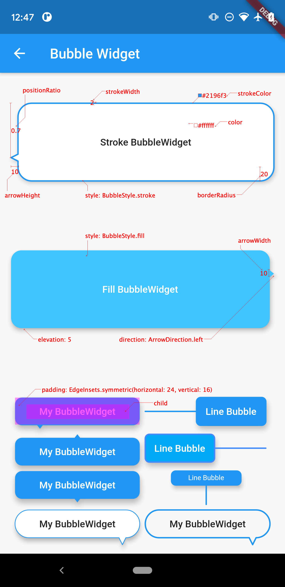

Language: [English](README.md) | [中文简体](README-ZH.md)

# bubble_widget

A bubble shape widget.

Supports common bubble style parameters: stroke, fill, arrow direction, size and so on.

## Getting Started

#### Add dependency

```yaml
dependencies:
  bubble_widget: 0.0.1
```

#### Usage

```dart
class BubbleWidgetExample extends StatelessWidget {
  @override
  Widget build(BuildContext context) {
    return Scaffold(
      appBar: AppBar(title: Text('BubbleWidgetExample')),
      body: Center(
        child: BubbleWidget(
          padding: EdgeInsets.all(8),
          color: Theme.of(context).primaryColor,
          child: Text('I\'m a bubble'),
        ),
      ),
    );
  }
}
```

#### Parameter List

| Parameter     |        Type        | Default Value         | Info                                                         |
| :------------ | :----------------: | :-------------------- | :----------------------------------------------------------- |
| child         |       Widget       | Null                  | required                                                     |
| padding       | EdgeInsetsGeometry | Null                  | Empty space to inscribe inside the `bubble content`. The`child` if any, is placed inside this padding. |
| color         |       Color        | Colors.transparent    | The color to paint behind the `child`                        |
| elevation     |       double       | 5.0                   | The z-coordinate at which to place this material relative to its parent. Default value is 0, when`color = Colors.transparent`. |
| style         |    BubbleStyle     | BubbleStyle.fill      | Bubble style                                                 |
| strokeColor   |       Color        | Colors.transparent    | Only valid on  `style = BubbleStyle.stroke`                  |
| strokeWidth   |       double       | 0.5                   | Only valid on  `style = BubbleStyle.stroke`                  |
| direction     |   ArrowDirection   | ArrowDirection.bottom | Bubble arrow's direction relative to itself                  |
| positionRatio |       double       | 0.5                   | Bubble arrow's position ratio, mast be `0.0~1.0`, relative to top-left `zero` coordinate，`0.5` represents the center of the bubble arrow edge |
| arrowHeight   |       double       | 5.0                   | Height of the bubble arrow                                   |
| arrowWidth    |       double       | 8.0                   | Width of the bubble arrow                                    |
| borderRadius  |       double       | 10.0                  | The corners of the bubble content                            |

#### Figure legends



#### NOTE:

* Parameter Auto-fix. To make it easier to use, the parameters `arrowHeight`, `borderRadius`, `arrowWidth`, and `positionRatio` are automatically corrected if invalid.
* `child` and `padding` of `BubbleWidget` only fill the bubble body except for the bubble arrow.
* When `arrowWidth = 0` and `style = BubbleStyle.stroke`, the arrow of the bubble will be displayed as a lead.

